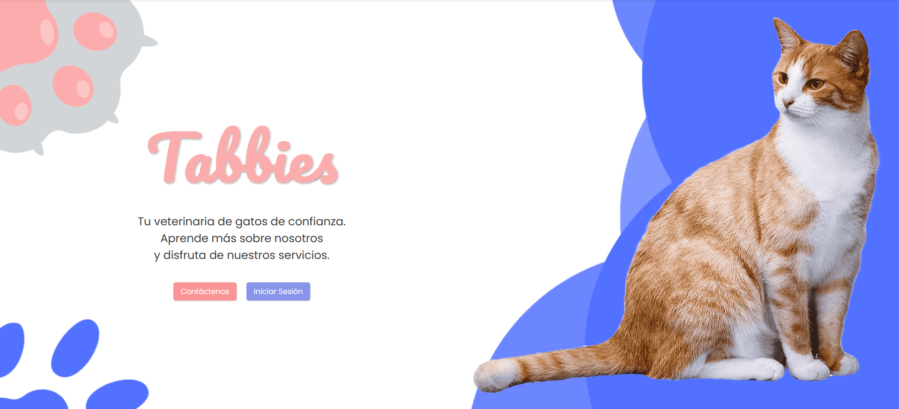

# Tabbies


Tabbies es un proyecto diseñado para ayudar a organizar y gestionar pestañas de manera eficiente. Con Tabbies, puedes mantener tus tareas y proyectos organizados, mejorando tu productividad.

## Características

- Gestión sencilla de pestañas.
- Organización por categorías o proyectos.
- Interfaz amigable y fácil de usar.

### Entidades
El siguiente sistema implementa CRUDs para las siguientes entidades:


## Instalación

1. Clona este repositorio:  
    ```bash
    git clone https://github.com/usuario/tabbies.git
    ```
2. Sigue las instrucciones en la documentación para configurar el entorno.

## Contribuir

¡Las contribuciones son bienvenidas! Si deseas colaborar, por favor abre un issue o envía un pull request.

## Licencia

Este proyecto está bajo la licencia MIT.